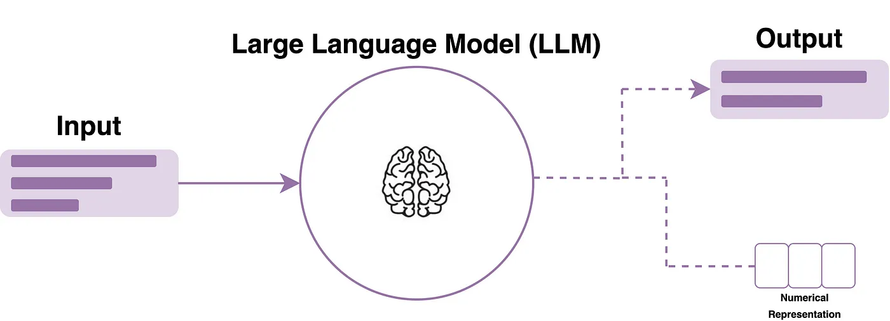

# LLM Primer

A multi-part seminar series on large language models (LLMs).

## Session 1 - History of NLP, Transformers and Landscape of LLMs

Covers important building blocks of what we call an LLM today, where they came from, etc. and then we'll dive into the deep universe that has sprung to life around these LLMs.

More details can be found [here](session_1).