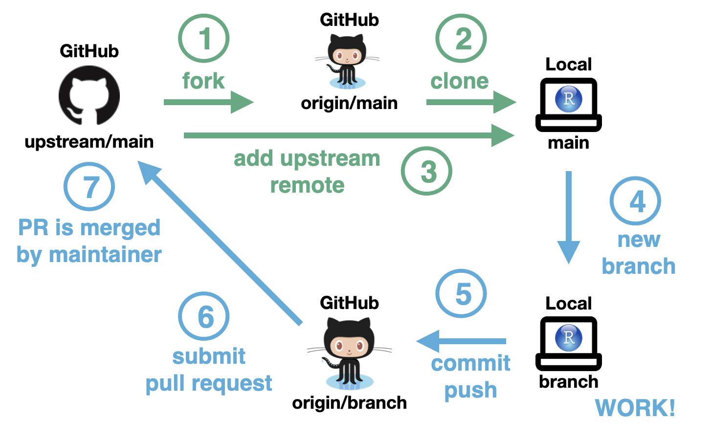

# Contribution Guide

This guide offers general tips to be followed when writing articles for LLM 
Seminar Series. Make sure to read it before opening a PR.

## How to start?

### Overview

* The [homepage](./../README.md) outlines the topics which are related to each other and can be covered in a single session. 

* A session is generally divided into multiple parts. For example, the first session was an introductory session and thus it was divided in 3 parts,
    1. Emergence of LLMs
    2. Building blocks of LLMs
    3. Overview of landscape of LLMs. 
   
* We would like to have a detailed article about each part.

### Step 1: Pick a topic

* Please go through the [homepage](./../README.md) and choose a topic of your interest. 
* It can be something which you have already used in the past or it can be something you want to learn next. 
* Following order is not mandatory, e.g., you can pick the last topic first too.

### Step 2: Create an issue.

* As soon as you decide the topic of your interest, [create a github issue here](https://github.com/infocusp/llm_seminar_series/issues).
* Once you create an issue, we will start sharing some useful references and also provide guidance for writing the perfect article.
* It also helps collaborating on same topic if multiple people are interested by discussing on the same github issue.

### Step 3: Fork the repo

* We recommend using github from day saving your progress.

* We follow *fork and pull request* workflow since its a collaborative project as described in the below image.

    

* In summary,
    * you should first fork [this repo](https://github.com/infocusp/llm_seminar_series),
    * create a new branch and add your commits in your branch,
    * once you are ready to submit an article; create a pull request.

* The detailed steps can be found here: [Contributing to a project](https://docs.github.com/en/get-started/exploring-projects-on-github/contributing-to-a-project)

### Step 5: Organizing the files

* We prefer a single markdown file for each article, but you can also submit a jupyter notebook.
* Put new articles under the following dir:
    * `llm_seminar_series/session_<session_number>/part_<part_number>_<part_name>/README.md` or `llm_seminar_series/session_<session_number>/part_<part_number>_<part_name>/<topic_name>.ipynb`
    * Where `session_number` can be found from the homepage, while `part_number` can be inferred from the outline of the session.
* If the article uses any additional source files, then put them along the main file. For example, check [RLHF.ipynb](https://github.com/infocusp/llm_seminar_series/tree/main/session_4/part_2_finetuning_lms_to_human_preferences).

### Step 6: Follow a consistent style

* Maintaining a consistent style across all the articles provides a good reading experience to our readers and often reduces review time.
* We have provided code and text style guides [separately here](STYLE_GUIDES.md). 
* You can refer them when crafting that perfect article.

### Step 7: Run the website locally

* We use [mkdocs](https://www.mkdocs.org/) to host our repo as a static website.
* All the articles will be automatically rendered to an html page once merged to main branch.
* But you can also host this website locally on your machine to visualize the final output which helps solving any formatting issues.
* Follow these commands to start a local server
    * Run `pip install -r requirements.txt` to install all the dependencies.
    * Run `mkdocs serve` to serve this website locally.
    * You will get this message on your terminal `Serving on http://127.0.0.1:8000/` from where you can access it.
    * Changes you make in the markdown are reflected immediately on the website which can help you quickly correct any formatting issues.

### Step 8: Review and approval

* Once you are happy with your article, just raise the PR as suggested in step 3.
* Maintainers of this repo will review the changes and guide you for any modifications if required.
* Once the PR is approved and merged into main branch, it will be live at the [website](https://infocusp.github.io/llm_seminar_series/), Congratulations 🎉.

### Step 9: YouTube Live session / Pre recorded video (optional step)

* While reading is still the best way to learn something, many prefer watching explanatory videos.
* We encourage every author to conduct a Youtube Live Session to walk us through the topic using the same article.
* The link to this video will be put along with the article for future visitors.
* While live streams are good for interacting with the audience and conduct Q&A, if you prefer to submit a prerecorded video then it's perfectly fine too.

!!! tip
     Maintainers of these repo will reach out to you with more details once your article is live.