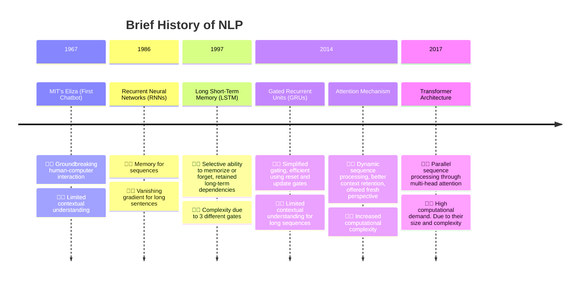
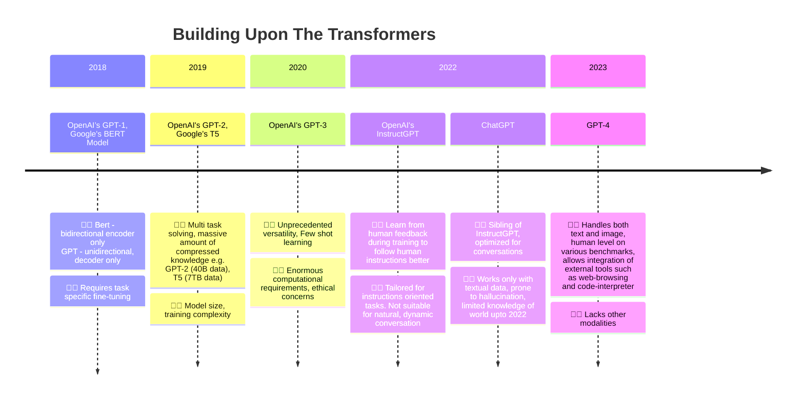

# The Emergence of LLMs

```mermaid
timeline
        title Brief History of NLP
        section 1967
          MIT’s Eliza (First Chatbot) : 👌🏼 Groundbreaking human-computer interaction : 👎🏼 Limited contextual understanding
        section 1986
          Recurrent Neural Networks (RNNs) : 👌🏼 Memory for sequences : 👎🏼 Vanishing gradient for long sentences
        section 1997
          Long Short-Term Memory (LSTM) : 👌🏼 Selective ability to memorize or forget, retained long-term dependencies : 👎🏼 Complexity due to 3 different gates
        section 2014
          Gated Recurrent Units (GRUs) : 👌🏼 Simplified gating, efficient using reset and update gates : 👎🏼 Limited contextual understanding for long sequences
          Attention Mechanism: 👌🏼 Dynamic sequence processing, better context retention, offered fresh perspective : 👎🏼 Increased computational complexity
        section 2017
          Transformer Architecture : 👌🏼 Parallel sequence processing through multi-head attention : 👎🏼 High computational demand. Due to their size and complexity
```

```mermaid
timeline
        title Building Upon The Transformers
        section 2018
          OpenAI’s GPT-1, Google's BERT Model : 👌🏼 Bert - bidirectional encoder only <br>  GPT - unidirectional, decoder only : 👎🏼 Requires task specific fine-tuning
        title Building Upon The Transformers
        section 2019
          OpenAI's GPT-2, Google’s T5 : 👌🏼 Multi task solving, massive amount of compressed knowledge e.g. GPT-2 (40B data), T5 (7TB data) : 👎🏼 Model size, training complexity
        section 2020
          OpenAI's GPT-3 : 👌🏼 Unprecedented versatility, Few shot learning : 👎🏼 Enormous computational requirements, ethical concerns
        section 2022
          OpenAI's InstructGPT : 👌🏼 Learn from human feedback during training to follow human instructions better : 👎🏼 Tailored for instructions oriented tasks. Not suitable for natural, dynamic conversation
          ChatGPT : 👌🏼 Sibling of InstructGPT, optimized for conversations : 👎🏼 Works only with textual data, prone to hallucination, limited knowledge of world upto 2022
        section 2023
          GPT-4 : 👌🏼 Handles both text and image, human level on various benchmarks, allows integration of external tools such as web-browsing and code-interpreter : 👎🏼 Lacks other modalities
```